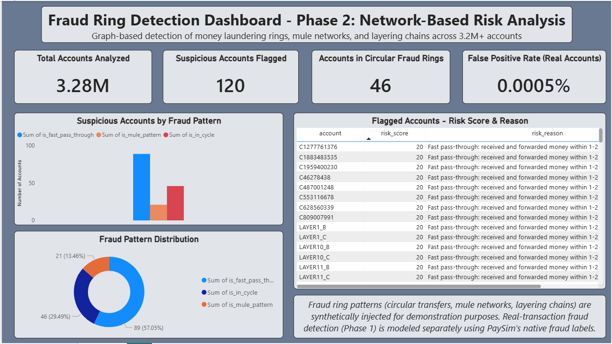

# Fraud Ring Detection: Transaction-Level + Network-Based Analysis

A two-phase fraud detection project on the PaySim dataset (6.3M+ simulated mobile money transactions). Phase 1 asks *"is this one transaction fraud?"* using supervised classification. Phase 2 asks a fundamentally different question — *"are groups of accounts secretly working together as a fraud ring?"* — using graph-based network analysis, since individual-transaction classifiers cannot detect coordinated fraud.

---

## Overview

| | Phase 1 | Phase 2 |
|---|---|---|
| **Question** | Is this transaction fraud? | Are these accounts part of a fraud ring? |
| **Approach** | Supervised classification (Random Forest) | Graph analysis (NetworkX) + rule-based risk scoring |
| **Ground truth** | Real PaySim fraud labels | Synthetically injected fraud ring scenarios |
| **Output** | Fraud / Not Fraud prediction | Explainable risk score + reason |

---

## Phase 1: Real Transaction Fraud Detection

**Dataset:** PaySim (6,362,620 transactions), filtered to `CASH_OUT` and `TRANSFER` types — the only transaction types where fraud occurs in this dataset (8,213 fraud cases, ~0.30% of filtered data).

**Feature engineering:** Built features capturing balance behavior around each transaction:
- `orig_balance_diff` / `dest_balance_diff` — mismatch between recorded balance change and transaction amount
- `orig_zero_balance_flag` / `dest_zero_balance_flag` — flags a known PaySim data-recording artifact (zero balances despite nonzero transaction amount)
- `amount_to_balance_ratio` — how much of the sender's balance was drained in one transaction

**Model 1 (initial):** A Random Forest trained on all engineered features achieved near-perfect precision/recall (100% / 99.6%). Investigation of feature importance revealed this was driven almost entirely by `amount_to_balance_ratio` and `orig_balance_diff` — both closely mirroring a known artifact of how PaySim's simulator generates fraud transactions (draining the sender's account to ~exactly 100% of its balance). This meant the model was exploiting a synthetic-data shortcut rather than learning generalizable fraud behavior.

**Model 2 (realistic):** Removing the shortcut-related features and retraining on destination-balance behavior, zero-balance flags, amount, and transaction type produced more modest, trustworthy results:

| Metric | Score |
|---|---|
| Precision (fraud class) | 0.84 |
| Recall (fraud class) | 0.67 |
| F1-score | 0.74 |

Feature importance was spread across multiple signals rather than dominated by one — closer to how a real fraud-review process combines several weaker cues.

**Key takeaway:** Near-perfect results on a synthetic benchmark should be treated with suspicion, not celebrated outright. Model 2's more modest performance is a more honest estimate of real-world generalizability.

---

## Phase 2: Graph-Based Network Risk Analysis

**Why graph-based:** Fraud rings — money laundering, mule networks — don't show up in single transactions. Modeling accounts as nodes and transactions as directed edges enables structural questions no row-level model can answer (e.g., "is this account part of a loop?").

**Ground truth problem:** No public dataset labels fraud *rings* — only individual fraud transactions. To address this, 40 synthetic fraud rings were injected into the real PaySim data:
- **10 circular rings** (A→B→C→D→A) — money laundering / layering pattern
- **14 mule networks** (multiple victims → 1 collector → 1 destination) — scam collection pattern
- **16 layering chains** (A→B→C→D→E, no return) — pure obfuscation pattern

This gives real transaction noise as background, with known ground truth for the part that cannot be labeled naturally.

**Graph construction:** Built using NetworkX — 3,277,766 accounts (nodes), 2,770,636 transactions (edges).

**Key features engineered:**
- **In-degree / out-degree** — number of distinct senders/receivers per account. *Found insufficient alone* — some legitimate high-volume accounts had higher in-degree (60-75) than synthetic mule accounts (5-10).
- **Timing (`step_span`)** — the missing signal. Legitimate high-volume accounts accumulate transactions over 300-690 hours; synthetic mule accounts collected within 1-2 hours. Speed, not just structure, separates real accounts from mules.
- **Cycle detection** — using `nx.simple_cycles()`, capped at length 6 (a performance necessity at this scale, also loosely consistent with typical real-world laundering ring sizes). Correctly identified all 10 synthetic circular rings with zero false positives.
- **Fast pass-through detection** — flags accounts that receive and forward money within 1-2 hours, catching layering chain behavior.

**Explainable risk scoring:**

| Signal | Points |
|---|---|
| Part of a circular transfer (cycle) | +40 |
| Mule collection pattern (fan-in + fast timing) | +30 |
| Fast pass-through behavior | +20 |

Each flagged account receives a score and a plain-English reason (e.g., *"Part of a circular money transfer (funds returned to origin); Fast pass-through: received and forwarded money within 1-2 hours"*), rather than a binary label — designed to support investigator triage, not automated decisions.

**Validation on real data:** Across all 3,277,509 real accounts, only 15 were flagged (8 fast pass-through, 7 mule pattern), and **zero** real accounts triggered the cycle detection rule.

| Metric | Value |
|---|---|
| Real accounts flagged | 15 / 3,277,509 |
| False-positive rate | 0.0005% |
| Synthetic rings correctly identified | 10 / 10 (cycles) |

---

## Network Visualization

Fraud ring subgraphs were visualized with distinct, recognizable shapes per pattern type:
- **Circular rings** → closed loops (squares/pentagons)
- **Mule networks** → star/fan shapes (multiple senders into one collector)
- **Layering chains** → short zigzag chains

See `/visuals/fraud_clusters_grid_v2.png` and `/visuals/fraud_network_graph.png`.

---

## Dashboard

A Power BI dashboard was built to present findings in a business-facing format for non-technical stakeholders (investigators, managers):

Includes: total accounts analyzed, suspicious accounts flagged, fraud pattern distribution, false-positive rate, and a sortable table of flagged accounts with risk scores and reasons.

`.pbix` file: `/dashboard/fraud_ring_detection_dashboard.pbix`

---

## Tech Stack

- **Python** — pandas, NumPy
- **Machine Learning** — scikit-learn (Random Forest)
- **Graph Analysis** — NetworkX
- **Visualization** — matplotlib, seaborn
- **Dashboard** — Power BI

---

## Key Learnings & Limitations

- **Synthetic-data artifacts can inflate results.** Model 1's near-perfect score was a red flag, not a win — investigating *why* a model performs "too well" is as important as the metric itself.
- **Structural features alone are insufficient for network fraud detection.** Timing/velocity was the missing dimension that separated legitimate high-volume accounts from synthetic mule accounts.
- **Ring-level ground truth doesn't exist in public data.** Phase 2's fraud rings are synthetically injected on top of real transaction data — this is an explicit, documented limitation, not a hidden assumption.
- **Cycle detection is capped at length 6** for computational feasibility at scale (3M+ nodes). A sophisticated ring using more hops specifically to evade detection would not be caught by this implementation.
- **A production system would combine this approach with additional signals** (account age, KYC data, device fingerprinting) rather than relying on transaction graph structure alone.

---

## How to Run

1. Download the PaySim dataset from [Kaggle](https://www.kaggle.com/datasets/ealaxi/paysim1) (not included in this repo due to size — see `/data/README.md`)
2. Install dependencies: pip install -r requirements.txt
3. 3. Open and run `fraud_detection_phase1_phase2.ipynb`
